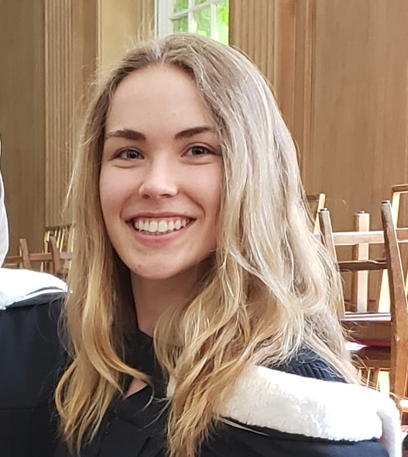
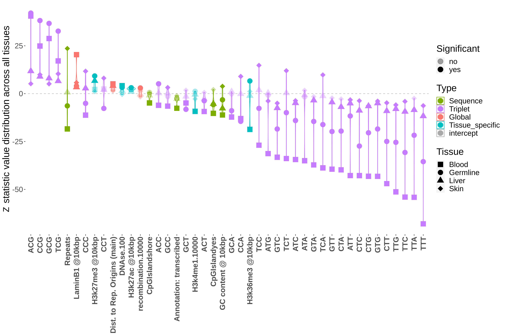
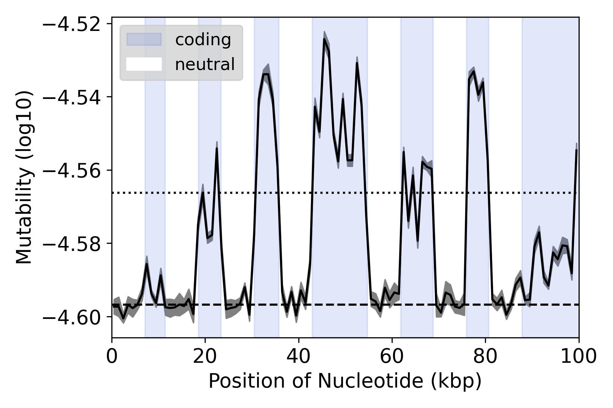

Madeleine Oman \
PhD University of Toronto - Expected fall 2025 \
madeleine.oman@mail.utoronto.ca\
@MadeleineOman\
[CV](Madeleine_Oman_CV.pdf) 

Human geneticist passionate about improving health outcomes, science communication and answering cool questions with big data and machine learning techniques. I work with Dr Rob Ness, check out the [lab website](https://ness.bio/). 
 
 
 

### Published projects 

#### Comparing the predictors of mutability among healthy human tissues inferred from mutations in single-cell genome data [link](https://academic.oup.com/genetics/article/229/3/iyae215/8015402?login=true) 

Ever wondered what causes mutation within you? The truth is that many processes and chemicals affect whether sites in the genome mutate, which includes the many molcules that exist innately within cells  (ie. transcription machinery, epigenetic marks). In this paper I leverage data from prexisiting pexeriments and build a machine learning models that predicts mutations in healathy tissues. I created highly accurate models (wihtin 2% error), and explore the question: are the factors that predict mutation consistent across tissues, or do they differ? 
 
 
 

#### How Sequence Context-Dependent Mutability Drives Mutation Rate Variation in the Genome  [link](https://academic.oup.com/genetics/article-lookup/doi/10.1093/genetics/iyae215)

One of the main factors that affects the likelihood of a site to mutate is actually the DNA itself (i.e. is the site an A/T/C/G?). However when a site mutates, the base will change and therefore its likelihood to mutate in the future also changes. This raises interesting questions about how genetic sequences evolve over time, which I address here in this paper using a simulated chromosome. 
 
 
 
 

### Teaching experience 
Outside of research I'm very passionate about the science of learnng and using actuve learning techniques to improve the undergraduate learning experience. I've held numerous roles in UfT academic student support programs including as a Senior Program Assistant at the [Facilitated Study Group Program](https://www.utm.utoronto.ca/asc/facilitated-study-groups-fsgs) and heading the [International Mentorship in Academic and Canadian Culture Program](https://www.utm.utoronto.ca/language-studies/student-resources/imacc-support-international-students). I'm also passionate in my role as a Teaching Assistant, having developed [course content](2020 BIO353 - Lab 4 _ Studentcopy_auxin_NPA_cytokinin.pdf) and held a position within the [TA training department](https://tatp.utoronto.ca/).  

