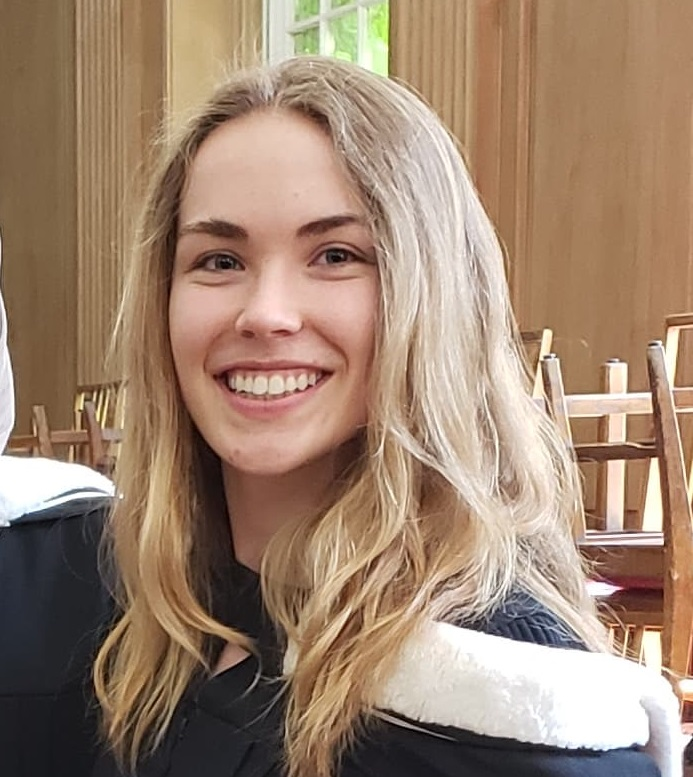

I'm a PhD student at the [Ness lab] (https://ness.bio/) at the [University of Toronto Mississauga](https://www.utm.utoronto.ca/biology/). I am broadly interested in mutation rate variation and how it varies across and within species. 

Outside of research I'm very passionate about improving the undergraduate learning experience. I'm invovled in numerous academic student support programs offered at UTM 

### Projects 

### Contact me 
madeleine.oman@mail.utoronto.ca